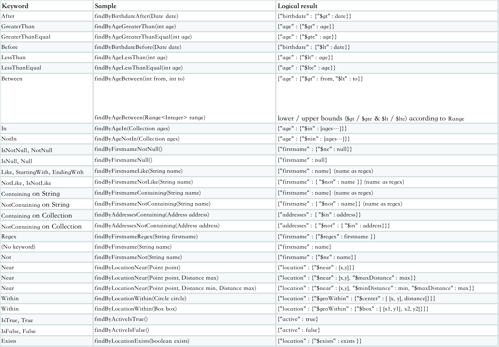

### 安装 nginx 1.8.0

```shell script
vim /etc/yum.repos.d/nginx.repo 


[nginx-stable]
name=nginx stable repo
baseurl=http://nginx.org/packages/centos/$releasever/$basearch/
gpgcheck=1
enabled=1
gpgkey=https://nginx.org/keys/nginx_signing.key
module_hotfixes=true

[nginx-mainline]
name=nginx mainline repo
baseurl=http://nginx.org/packages/mainline/centos/$releasever/$basearch/
gpgcheck=1
enabled=0
gpgkey=https://nginx.org/keys/nginx_signing.key
module_hotfixes=true


yum info nginx
yum install nginx
systemctl start nginx #启动
systemctl stop nginx #停止
systemctl reload nginx #重启
systemctl status nginx #状态
systemctl enable nginx #自启

vim /etc/yum.repos.d/mongodb-org-4.4.repo

[mongodb-org-4.4]
name=MongoDB Repository
baseurl=https://repo.mongodb.org/yum/redhat/$releasever/mongodb-org/4.4/x86_64/
gpgcheck=1
enabled=1
gpgkey=https://www.mongodb.org/static/pgp/server-4.4.asc


```

### 安装 JDK
```shell script
rpm -ivh jdk-15_linux-x64_bin.rpm
```
chmod +x /home/shop-service-0.0.1-SNAPSHOT.jar 
ln -s /home/shop-service-0.0.1-SNAPSHOT.jar /etc/init.d/shop

chmod +x /home/store-service-0.0.1-SNAPSHOT.jar 
ln -s /home/store-service-0.0.1-SNAPSHOT.jar /etc/init.d/store

